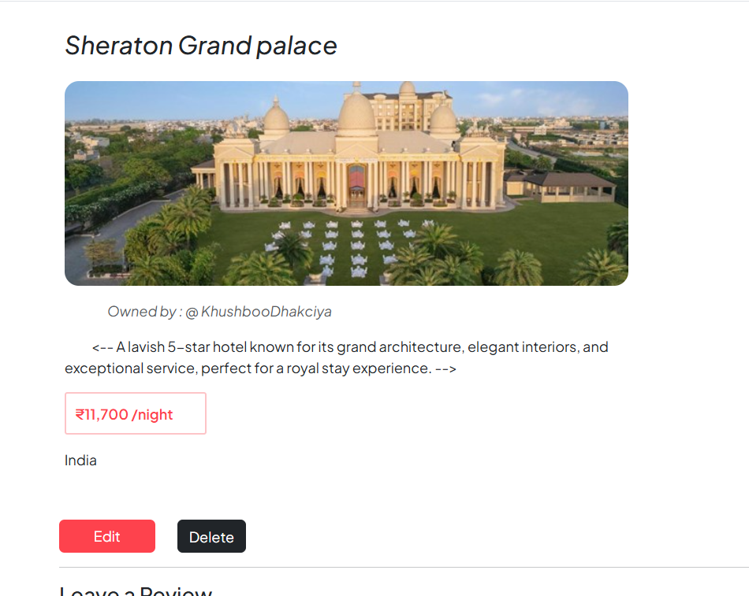
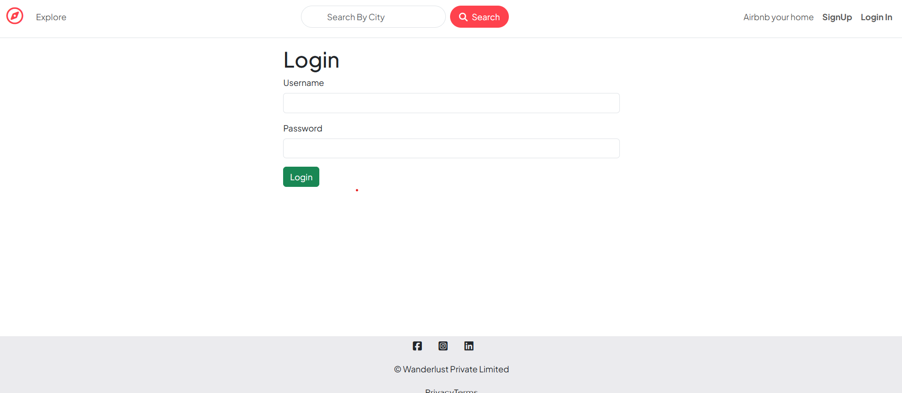
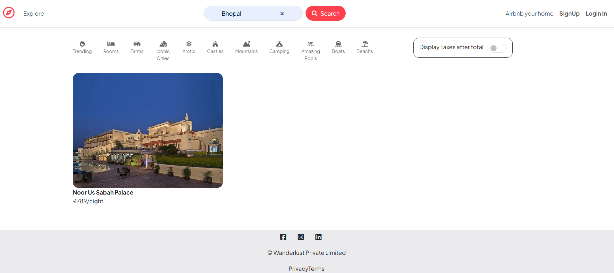
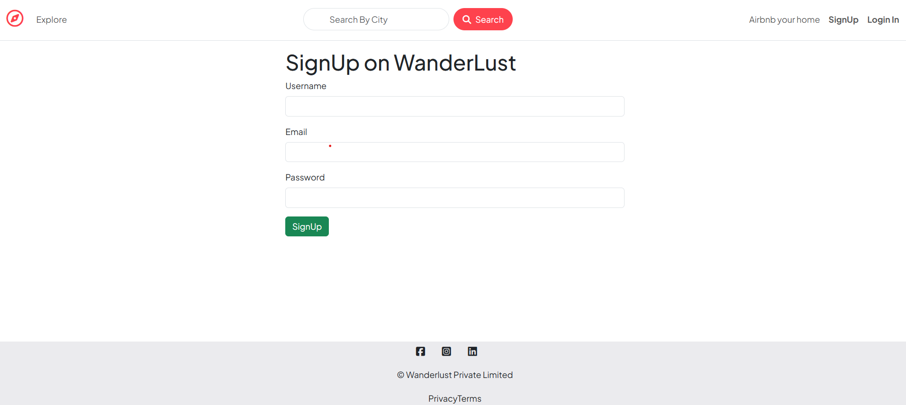
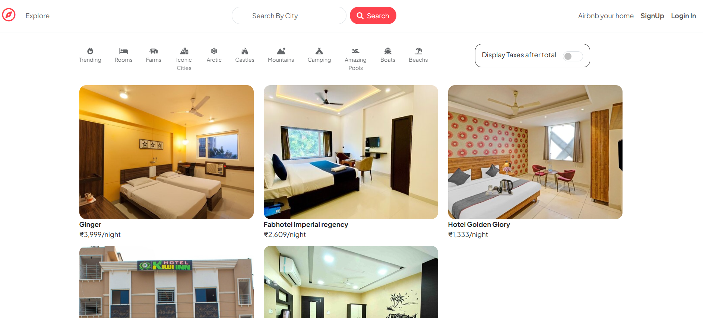

# Wanderlust - Hotel Rental System 🌍🏨

## About the Project 📝
Wanderlust is a hotel rental system that provides an easy and intuitive way for users to search for hotels, view availability, and make reservations.

## Features ✨
- User-friendly login and signup system 🔑
- Hotel search with filters (location, price, amenities) 🔍
- Hotel detail pages showing room availability and prices 🏨
- Booking functionality to make reservations 🛏️
- Admin dashboard to manage bookings and hotel details 📊

## Screenshots 📸
Below are the screenshots taken from the project:

| Section               | Screenshot                        |
|-----------------------|-----------------------------------|
| **Create Listing**     |     |
| **Listing Details**    |   |
| **Landing Page**       |  |
| **Login Form**         |       |
| **Review + Map**       |  |
| **Search Bar**         |     |
| **Signup Form**        |     |
| **Toggle**             |     |

## Technologies Used 🛠️
- **Frontend**: HTML, CSS, Bootstrap 🎨
- **Backend**: Node.js ⚙️
- **Database**: MySQL 🗄️
- **Version Control**: Git, GitHub 🧑‍💻

## Installation 🏠
To run the project locally:

1. Clone the repository: 
   ```bash
   git clone <repository-URL>
   
2. Navigate to the project folder:
   ```bash
   cd wanderlust
   
3. Install dependencies:
   ```bash
   npm install

4. Start the server:
   ```bash
   npm start
   
Open your browser and go to http://localhost:3000.

## Contributing 🤝
Feel free to fork the repository, create a new branch, make changes, and submit a pull request. All contributions are welcome!

## Made with ❤️ by Khushboo Dhakciya ✨🚀
